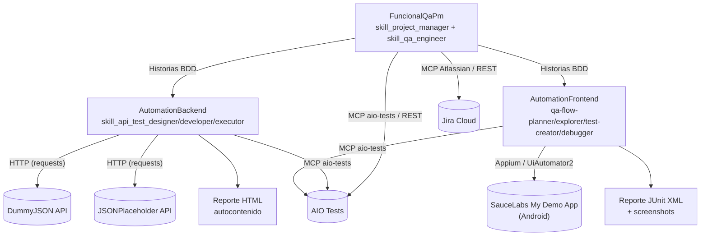
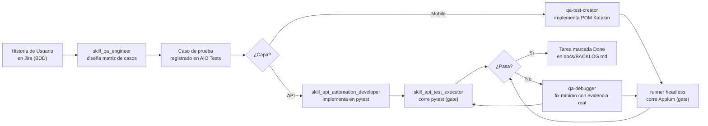

# MyDemoApp

Sistema de **Súper Agentes Orquestadores** (Scrum Master AI) que gestiona el trabajo
diario de un QA funcional + Automatizador dentro de un proyecto ágil: refinamiento de
Historias de Usuario en formato BDD, diseño y automatización de Casos de Prueba, y
reporte de bugs — delegando cada fase a skills de IA especializadas, integradas de
forma nativa con herramientas reales de gestión de proyectos (Jira, AIO Tests) y de
automatización de pruebas (Appium/Katalon para la app móvil, `pytest` para su capa de
servicios).

La implementación de referencia de este repo cubre una **app modular** real —
[SauceLabs My Demo App](https://github.com/saucelabs/my-demo-app-android) (módulos de
Login, Catálogo y Checkout) y su capa de servicios simulada con APIs públicas
(DummyJSON, JSONPlaceholder) — pero el sistema de skills no está atado a este dominio:
puedes clonar el módulo que necesites y adaptarlo a tu propio proyecto/app. No hay
credenciales privadas ni sistemas internos involucrados en ningún punto del repo.

Todo el código, la arquitectura y esta documentación se construyeron con **Claude Code**
como agente principal — la bitácora completa (herramientas, prompts reales usados, y los
errores/alucinaciones detectados y corregidos durante el desarrollo) está documentada con
total transparencia en [`AI_USAGE.md`](AI_USAGE.md).

## Introduccion Acotada
[Material en formato multimedia MyDemoApp](https://drive.google.com/drive/folders/1YqQcg-jrwsWVsjE30g34GaHhbBVu91HR?usp=sharing)

## Índice

- [Cómo funciona](#cómo-funciona)
- [Flujo de un caso de prueba](#flujo-de-un-caso-de-prueba)
- [Estructura del repositorio](#estructura-del-repositorio)
- [Ejecutar todo desde la raíz (instancia única)](#ejecutar-todo-desde-la-raíz-instancia-única)
- [Integraciones reales configuradas](#integraciones-reales-configuradas)
- [Requisitos previos](#requisitos-previos)
- [Instalación paso a paso](#instalación-paso-a-paso)
- [Ejecutar las suites y generar reportes](#ejecutar-las-suites-y-generar-reportes)
- [Convenciones comunes a todas las skills](#convenciones-comunes-a-todas-las-skills)

## Cómo funciona

Cada módulo evolucionó de forma independiente y tiene su **propio** orquestador — no
comparten un único pipeline genérico. El diagrama muestra los 3 módulos reales, sus
skills y las integraciones externas que usan:



Cada skill vive como una carpeta de *prompts* en `.prompts/<skill>/` con:
- `system.md` — rol, estándar de calidad y flujo de trabajo obligatorio de esa skill.
- `tools.md` — cómo se integra con el sistema externo real (MCP, API REST, CLI de respaldo).
- `examples.md` / `test_spec.md` / etc. — plantillas de invocación y ejemplos rellenos.

Cada orquestador de módulo no improvisa: si una skill referenciada en su catálogo no tiene su
carpeta implementada todavía, se detiene y lo informa en vez de simular su comportamiento (ver
la regla crítica en cada `super_agent_*.md`).

## Flujo de un caso de prueba

De una Historia de Usuario en Jira a un test ejecutado y reportado — la misma matriz de diseño
se bifurca según la capa que le corresponde automatizar (API o Mobile), pero ambas pasan por el
mismo gate obligatorio: no hay tarea `Done` sin ejecución real.



Dos casos reales de este flujo, recorridos paso a paso hasta el archivo y la línea exacta que
los implementa (árbol de directorios incluido): [Happy Path — SIM-TC-12 Create User](https://jonnyboth.github.io/MyDemoApp/backend-happy-path.html)
(`AutomationBackend`) y [Arquitectura de 3 capas — AutomationFrontend](https://jonnyboth.github.io/MyDemoApp/frontend-3-layers.html)
(`AutomationFrontend`). Índice completo en [`docs/`](docs/index.html) — requiere GitHub Pages
habilitado sobre `main` / `docs` (Settings → Pages) para verse online; mientras tanto, los
mismos archivos se pueden abrir localmente desde `docs/*.html`.

## Estructura del repositorio

Cada módulo tiene su propio orquestador con nombre identificable (ya no comparten el genérico
`super_agent.md`), para poder invocar el de cualquier módulo sin ambigüedad desde una única
sesión abierta en la raíz del repositorio:

| Módulo | Rol | Orquestador | Skills implementadas |
|---|---|---|---|
| [`FuncionalQaPm/`](FuncionalQaPm) | Gestión funcional de backlog y QA manual/exploratorio (Jira + AIO Tests) | [`super_agent_Qa_PM.md`](FuncionalQaPm/.prompts/super_agent_Qa_PM.md) | `skill_project_manager`, `skill_qa_engineer` |
| [`AutomationBackend/`](AutomationBackend) | Automatización de pruebas de la capa de servicios/API (`pytest` + `requests`) | [`super_agent_automation_backend.md`](AutomationBackend/.prompts/super_agent_automation_backend.md) | `skill_api_test_designer`, `skill_api_automation_developer`, `skill_api_test_executor` |
| [`AutomationFrontend/`](AutomationFrontend) | Automatización de la app móvil Android (Katalon Studio + Appium, runner headless) | [`qa-orchestrator.md`](AutomationFrontend/.claude/agents/qa-orchestrator.md) | `qa-flow-planner`, `qa-explorer`, `qa-test-creator`, `qa-debugger` |

> Cada módulo evolucionó de forma independiente según la capa que cubre: `FuncionalQaPm` es
> gestión funcional (PM + QA manual/exploratorio), mientras que `AutomationBackend` y
> `AutomationFrontend` implementan cada uno su propio ciclo diseño → construcción → ejecución
> para su capa de automatización (API y móvil, respectivamente).

### Dentro de `AutomationBackend/` — framework de API en capas

```
AutomationBackend/tests/
├── config/       → environment.py (carga .env), endpoints.py (rutas por dominio)
├── core/         → http_client.py (Session + retry/backoff), session_manager.py
│                   (login/caché de token), html_report.py (reporte propio sin deps externas)
├── models/       → DTOs Pydantic por dominio (user_model.py)
├── builders/     → builders encadenables para armar payloads (user_builder.py)
├── services/     → operaciones de negocio sobre HttpClient (users_service.py)
├── utils/        → assertions.py, data_generator.py (wrappers de Faker)
└── tests/
    ├── component/  → fuente única de verdad: 1 archivo por endpoint/TC
    ├── smoke/      → reexporta (import) el camino feliz de component/, sin duplicar lógica
    ├── regression/ → reexporta camino feliz + alternos de component/
    └── e2e/        → flujos de negocio propios encadenando varios endpoints
```

> **Estado actual de cobertura:** el dominio `users` (contra DummyJSON) está completo —
> `component`/`smoke`/`regression` con trazabilidad a `SIM-TC-12..15`. Los dominios `auth` y
> `posts` (contra JSONPlaceholder) están soportados por la arquitectura (`config/endpoints.py`
> ya los referencia) pero **sin tests implementados todavía** — es el siguiente trabajo
> pendiente, no cobertura ya entregada. Detalle capa por capa:
> [`docs/ARCHITECTURE.md`](AutomationBackend/docs/ARCHITECTURE.md) ·
> [`tests/docs/MODULES.md`](AutomationBackend/tests/docs/MODULES.md).

### Dentro de `AutomationFrontend/` — Page Object Model de 3 capas

| Carpeta | Contenido |
|---|---|
| [`Object Repository/android/`](AutomationFrontend/Object%20Repository) | Locators (`.rs`) por pantalla: Login, Menu, Products, ProductDetail, Cart, Checkout, Payment |
| `Keywords/` | Clases Groovy `Page` (interacción cruda con UI) y `Steps` (keywords `@Keyword` que exponen esas acciones) |
| `Scripts/` / `Test Cases/` | Cuerpo de cada test y su definición `.tc` de Katalon |
| `Profiles/default.glbl` | Variables globales (`G_Platform`, `G_AppBundleID=com.saucelabs.mydemoapp.android`, dispositivo) |
| [`runner/`](AutomationFrontend/runner) | Runner headless propio (`KatalonRunner.groovy`) que ejecuta Test Cases vía Appium/Selenium sin abrir la IDE de Katalon |
| [`runnerTestingTool/`](AutomationFrontend/runnerTestingTool) | Guía para instalar este runner en otro proyecto Katalon |
| `WebKeywords/` | Scaffold de automatización **web** (Playwright) — inactivo a propósito; el foco de este repo es Android (ver [`CLAUDE.md`](AutomationFrontend/CLAUDE.md)) |
| `.claude/skills/`, `.github/orchestrator/` | Skills del pipeline de 5 pasos: Planificar → Explorar → Crear Tests → Correr Tests → Validar |

## Ejecutar todo desde la raíz (instancia única)

La raíz del repositorio tiene su propio [`.mcp.json`](.mcp.json), que agrega los servidores MCP
de los 3 módulos con orquestador (Zephyr, Atlassian, Playwright, aisquare-playwright, mobile-mcp,
aio-tests-mcp, y una variante de `appium-mcp` por módulo). Al abrir una sesión de Claude Code con
`MyDemoApp` como carpeta raíz del workspace, las herramientas de los 3 módulos quedan disponibles
en la misma sesión — no hace falta reabrir el editor dentro de cada subcarpeta.

Para trabajar como el QA/PM, el de automatización de backend o el de automatización móvil, dile
al agente que siga las instrucciones del orquestador correspondiente de la tabla de arriba; las
herramientas MCP de ese módulo ya están conectadas. Cada módulo conserva también su propio
`.mcp.json` local, así que sigue funcionando igual si alguien prefiere abrir Claude Code aislado
dentro de esa subcarpeta en vez de en la raíz.

## Integraciones reales configuradas

- **Jira Cloud**: creación de Historias de Usuario y reporte de bugs vía el MCP de Atlassian
  (`com.atlassian/atlassian-mcp-server`), con un script Python de contingencia (REST API) si el
  MCP no está disponible en la sesión.
- **AIO Tests** (gestión de casos de prueba sobre Jira Cloud): creación/actualización/búsqueda
  de Casos de Prueba vía MCP dedicado o cliente REST propio (`aio_tests_client.py`), con triage
  anti-duplicados obligatorio antes de crear un caso nuevo.
- **Automatización de exploración**: `playwright-mcp` / `aisquare-playwright` para web,
  `appium-mcp` / `mobile-mcp` para móvil, usados por `skill_qa_engineer` cuando un requerimiento
  es ambiguo y necesita evidencia real antes de diseñar un caso de prueba.
- **Automatización de ejecución**: Katalon Studio + Appium (runner headless propio, sin
  licencia Enterprise) para la app móvil Android; `pytest` + `requests` para la capa de
  servicios/API — ambos son el gate obligatorio antes de marcar una tarea `[Done]`.

## Requisitos previos

### Comunes a todos los módulos

| Herramienta | Versión | Para qué |
|---|---|---|
| Node.js | 18 LTS+ | Raíz (`.mcp.json`, servidores MCP vía `npx`), `AutomationFrontend`, `FuncionalQaPm` |
| Git | reciente | Clonar y versionar el repo |
| Claude Code (o agente MCP-compatible) | reciente | Ejecutar los `super_agent_*.md` con las herramientas MCP conectadas |

### `AutomationFrontend` (móvil, Katalon + Appium)

| Herramienta | Versión | Verificación |
|---|---|---|
| Java (JDK) | 17+ (probado con 21) | `java -version` |
| Gradle | 8.9+ (no hay wrapper versionado; debe estar instalado globalmente) | `gradle -v` |
| Appium Server | 2.x | `appium -v` |
| Driver `uiautomator2` | 4.x | `appium driver list --installed` |
| Android SDK / `platform-tools` | API 33+, con `ANDROID_HOME`/`ANDROID_SDK_ROOT` en el PATH | `adb version` |
| Emulador/dispositivo Android | AVD `qa_android` (Pixel 6, API 34) o real, con `com.saucelabs.mydemoapp.android` (SauceLabs My Demo App) instalada y autorizado por `adb` | `adb devices` |

`AutomationFrontend` no usa un archivo `.env`: `KATALON_PROJECT_DIR`, `ANDROID_HOME` y
`ANDROID_SDK_ROOT` deben quedar **exportados en el shell** antes de correr el runner. Detalle
completo (incluida la instalación rápida en macOS y el checklist de portabilidad):
[`AutomationFrontend/runner/SETUP.md`](AutomationFrontend/runner/SETUP.md).

### `AutomationBackend` (API)

| Herramienta | Versión | Para qué |
|---|---|---|
| Python | 3.12+ | Framework `pytest` + `requests` en `AutomationBackend/tests/` |
| pip / venv | incluido en Python 3.12+ | Entorno virtual aislado (ver instalación abajo) |

### `FuncionalQaPm` (gestión funcional)

| Herramienta | Versión | Para qué |
|---|---|---|
| Python | 3.10+ | Scripts de contingencia REST (`create_jira_story.py`, `aio_tests_client.py`) cuando el MCP no está disponible — opcional si solo usas la vía MCP |

## Instalación paso a paso

```bash
git clone https://github.com/Jonnyboth/MyDemoApp.git && cd MyDemoApp

# Mobile (Katalon headless runner + Appium)
cd AutomationFrontend
npm install
emulator -avd qa_android &                 # o conecta un dispositivo real (adb devices)
appium &                                   # Appium server en localhost:4723
cd runner && gradle shadowJar && cd ..      # build inicial del runner (luego es automático)

# Backend (API)
cd ../AutomationBackend/tests
python -m venv venv && source venv/bin/activate   # Windows: venv\Scripts\activate
pip install -r requirements.txt
cp .env.example .env                        # BASE_URL por defecto: dummyjson.com / jsonplaceholder.typicode.com
```

Copia también `.prompts/<skill>/.env.example` a `.env` en cada skill que lo requiera (Jira, AIO
Tests) dentro de `FuncionalQaPm/` — **nunca** commitees el `.env` real. Ninguno de estos `.env`
es necesario para correr las suites de automatización (mobile/API); solo para los scripts de
integración con Jira/AIO Tests.

## Ejecutar las suites y generar reportes

```bash
# Mobile — desde AutomationFrontend/
bash runner/run.sh list                     # lista los TCs disponibles
bash runner/run.sh run --all                # corre toda la suite
bash runner/run.sh run --case android/SIM-TC-4-loginExitoso
# Reportes: runner/reports/test-results.xml (JUnit) + screenshot en cada fallo

# Backend — desde AutomationBackend/tests/ con el venv activo
pytest                                      # suite exhaustiva (component + e2e)
pytest tests/smoke/                         # gate rápido
pytest tests/regression/                    # regresión curada
# Reporte HTML autocontenido en tests/<carpeta>/reports/, con historial por corrida
```

Detalle completo de arquitectura y convenciones de cada suite:
[`AutomationFrontend/runner/SETUP.md`](AutomationFrontend/runner/SETUP.md) y
[`AutomationBackend/tests/README.md`](AutomationBackend/tests/README.md).

## Convenciones comunes a todas las skills

- Todo el contenido generado (HUs, casos de prueba, bugs) se redacta en español.
- Ninguna skill marca una tarea como `Done` sin pasar por verificación de QA ni sin correr la
  suite real (pytest o runner Appium) — nunca se acepta código sin evidencia real de ejecución.
- Ninguna skill inventa datos, IDs o campos de configuración que no haya podido confirmar
  contra la herramienta real — ante un error o un dato no verificable, se detiene e informa.
- Los tests de `AutomationBackend` con trazabilidad a un TC de AIO Tests siguen la convención
  `test_<KEY_SIN_GUIONES>_<descripcion>` (ej. `test_SIM_TC_12_create_user`).
